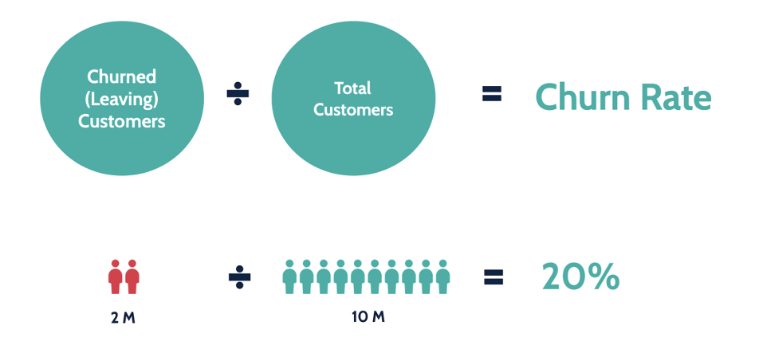

# Predicción de Tasa de Abandono (Churn) de Clientes



## Introducción

En este proyecto, se aborda el problema de la **tasa de abandono de clientes** (churn) en una empresa. El churn se refiere a la cantidad de clientes que dejan de utilizar los servicios de una compañía en un período determinado. Reducir la tasa de churn es crucial para cualquier empresa, ya que retener clientes es generalmente más rentable que adquirir nuevos.

El objetivo principal de este proyecto es identificar el modelo de machine learning que mejor se ajuste a los datos y ofrezca la mayor capacidad predictiva para detectar a los clientes con mayor probabilidad de darse de baja del servicio. Esto permitirá implementar estrategias de retención más efectivas y, en consecuencia, mejorar la retención de clientes y la sostenibilidad a largo plazo de la empresa.

## Dataset

Para este análisis, se ha utilizado el conjunto de datos de [Customer Churn Dataset (Kaggle)](https://www.kaggle.com/datasets/muhammadshahidazeem/customer-churn-dataset). Este dataset contiene información sobre varios aspectos del comportamiento del cliente, como su demografía, historial de compra, y otros factores relevantes que podrían influir en su decisión de abandonar el servicio.

## Metodología

El proyecto sigue una metodología estructurada que incluye las siguientes etapas:

1. **Exploración y preprocesamiento de datos**:
   - Análisis descriptivo
   - Análisis de dispersión y gráficos exploratorios
   - Análisis de correlación

2. **Modelado y Evaluación**:
   - Aplicación de varios modelos de machine learning como Random Forest, Redes neuronales y XGBoost, entre otros.
   - Evaluación de los modelos utilizando métricas como precisión, recall, F1-score.

3. **Optimización de Hiperparámetros**:
   - Uso de framework de Optuna para la búsqueda de hiperparámetros.

4. **Implementación de Estrategias de Retención**:
   - Basado en los resultados del modelo, se proponen estrategias específicas para mejorar la retención de clientes.

## Código y Explicación

El código utilizado en este proyecto está estructurado en un Jupyter Notebook, el cual contiene celdas de código y explicaciones detalladas. A continuación, se describen algunas de las secciones clave del notebook:

### 1. Importación de Librerías y Carga de Datos
```python
# Importación de librerías
import pandas as pd
import numpy as np
from sklearn.model_selection import train_test_split
from sklearn.preprocessing import StandardScaler
from sklearn.metrics import classification_report, confusion_matrix

# Carga de datos
df = pd.read_csv('customer_churn.csv')
```

### 2. Exploración de Datos
```python
# Exploración inicial de los datos
print(df.head())
print(df.info())
```

### 3. Preprocesamiento de Datos
```python
# Preprocesamiento de los datos
df = df.dropna()
df['TotalCharges'] = pd.to_numeric(df['TotalCharges'], errors='coerce')
df = pd.get_dummies(df, drop_first=True)
```

### 4. Modelado
```python
# Entrenamiento de un modelo de Random Forest
from sklearn.ensemble import RandomForestClassifier

X = df.drop('Churn', axis=1)
y = df['Churn']

X_train, X_test, y_train, y_test = train_test_split(X, y, test_size=0.3, random_state=101)

rfc = RandomForestClassifier()
rfc.fit(X_train, y_train)

# Predicción y evaluación del modelo
predictions = rfc.predict(X_test)
print(classification_report(y_test, predictions))
```

### 5. Optimización de Hiperparámetros
```python
# Optimización de hiperparámetros con GridSearch
from sklearn.model_selection import GridSearchCV

param_grid = {
    'n_estimators': [100, 200, 300],
    'max_depth': [10, 20, 30],
    'min_samples_split': [2, 5, 10]
}

grid_rfc = GridSearchCV(estimator=rfc, param_grid=param_grid, cv=5)
grid_rfc.fit(X_train, y_train)
```

### Conclusión

Este proyecto proporciona una guía completa para la implementación de un modelo de machine learning orientado a la predicción de churn. La combinación de técnicas de preprocesamiento, modelado, y optimización asegura que el modelo final tenga una alta capacidad predictiva, lo que es esencial para cualquier estrategia de retención de clientes.

---

Este archivo README está diseñado para proporcionar una visión general clara y detallada del proyecto, y debería ser un buen punto de partida para cualquier persona interesada en comprender y replicar el análisis realizado.
